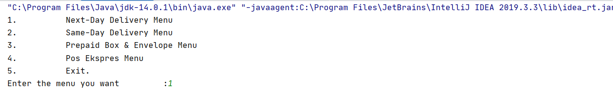
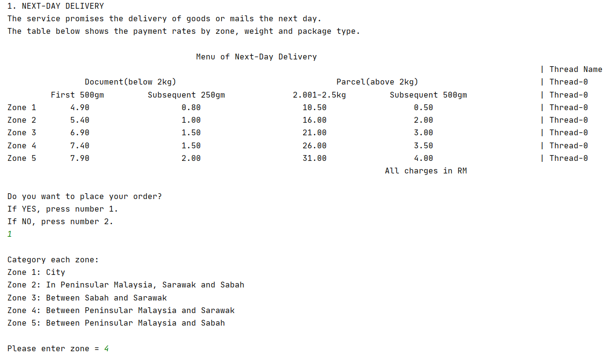
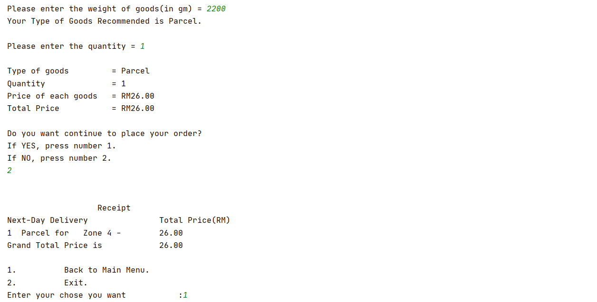
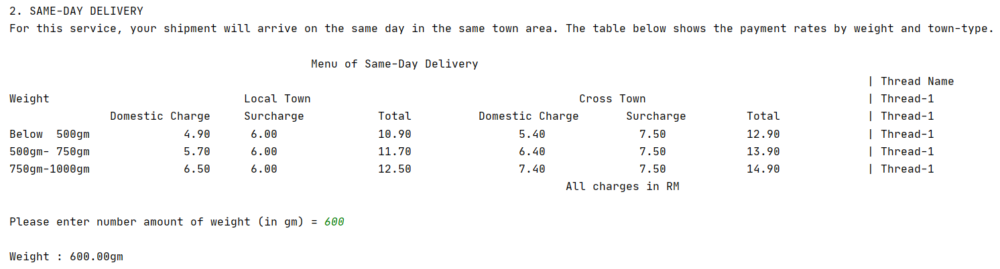
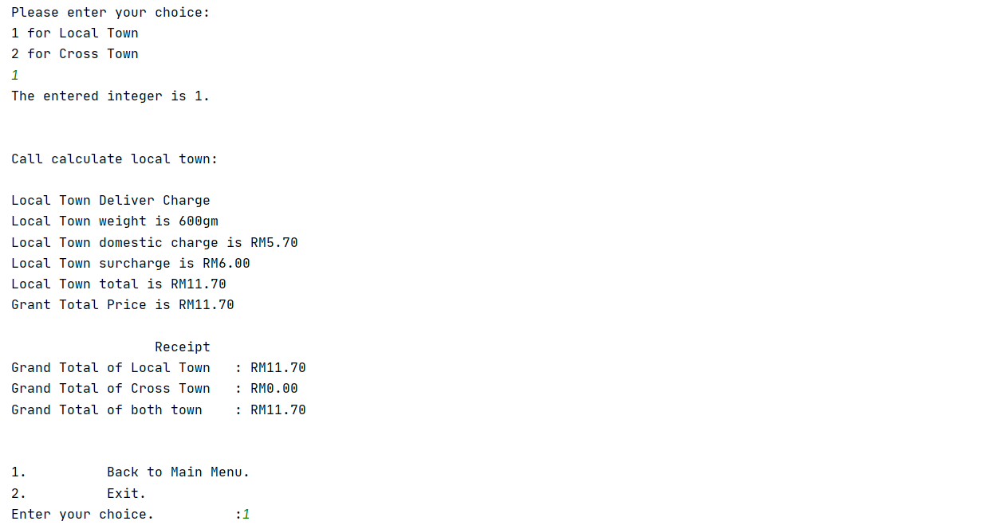
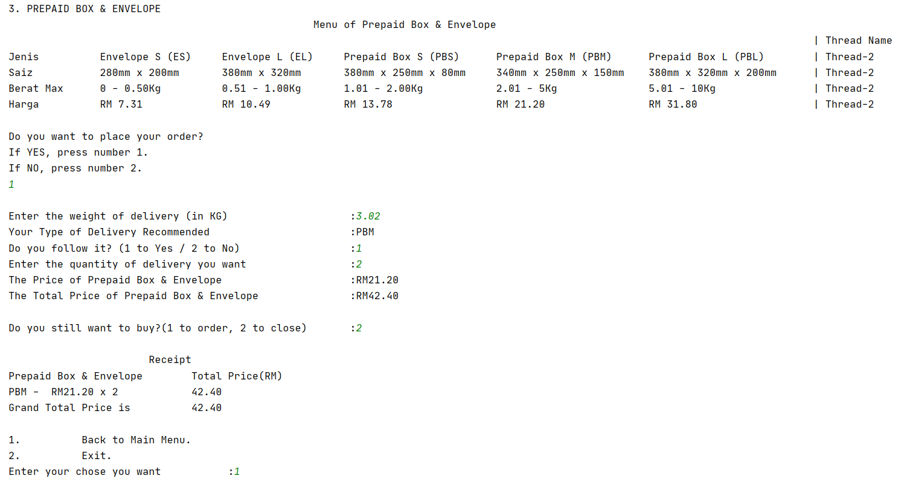
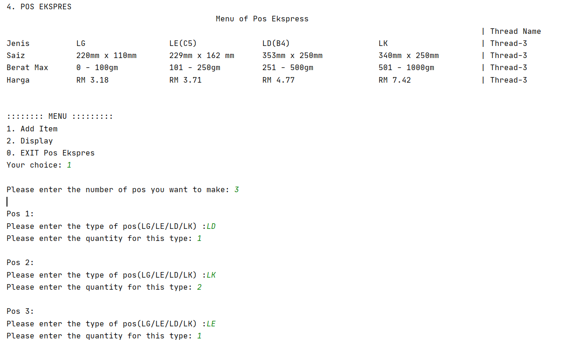
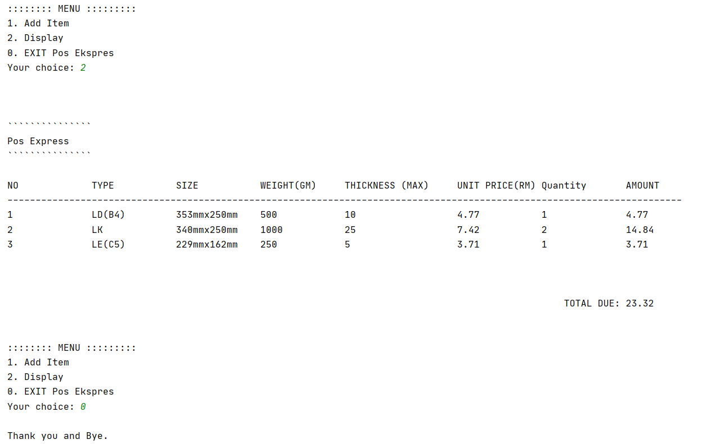
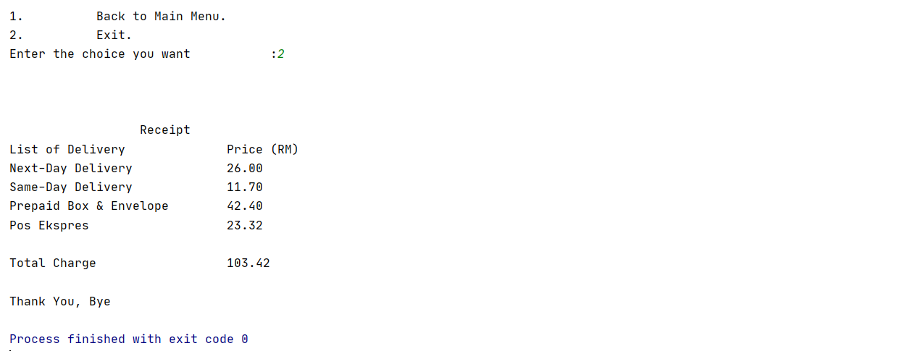
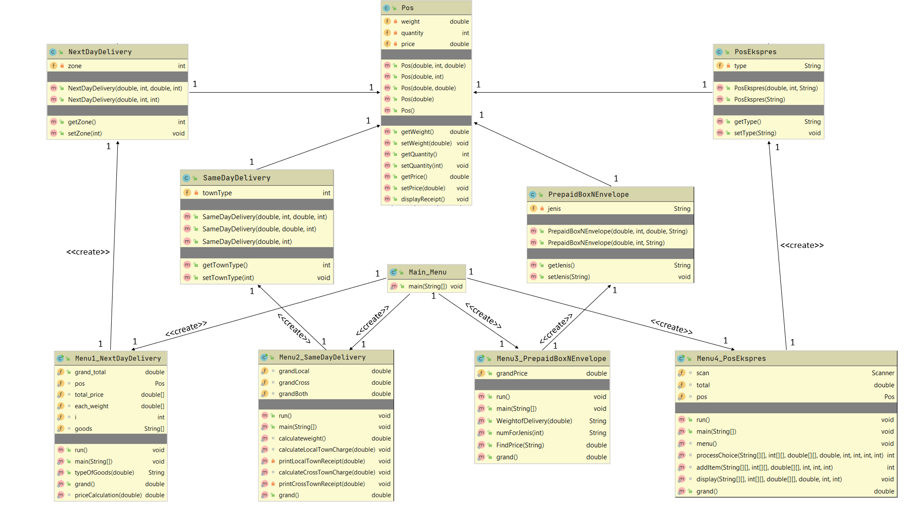

## Student Info:
261938 Lim Wen Liang </br>
     

2. Other related info (if any)

## Introduction
In this Pos Laju Application, I have learned about Java Threads by modified the source code.
The source code had modified by implement Runnable, create threads, implement thread sleep and display threads' name.

## Result/Output










## UML Class Diagram


## Examples of your program  
1. Implementing Runnable     
   ```java
   public class Menu1_NextDayDelivery implements Runnable {
       @Override
       public void run() {
               String format1 = "%35s%50s%27s%s%n";
               String format2 = "%20s%25s%25s%25s%17s%s%n";
               String format3 = "%-10s%7s%23s%26s%22s%24s%s%n";
               String format4 = "%95s%n";
   
               System.out.println("1. NEXT-DAY DELIVERY");
               System.out.println("The service promises the delivery of goods or mails the next day. \nThe table below shows the payment rates by zone, weight and package type.\n");
               System.out.printf("%64s\n", "Menu of Next-Day Delivery");
               System.out.printf("%123s\n", "| Thread Name");
               System.out.printf(format1, "Document(below 2kg)", "Parcel(above 2kg)", "| ", Thread.currentThread().getName());
               System.out.printf(format2, "First 500gm", "Subsequent 250gm", "2.001-2.5kg", "Subsequent 500gm", "| ", Thread.currentThread().getName());
               System.out.printf(format3, "Zone 1", "4.90", "0.80", "10.50", "0.50", "| ", Thread.currentThread().getName());
               System.out.printf(format3, "Zone 2", "5.40", "1.00", "16.00", "2.00", "| ", Thread.currentThread().getName());
               System.out.printf(format3, "Zone 3", "6.90", "1.50", "21.00", "3.00", "| ", Thread.currentThread().getName());
               System.out.printf(format3, "Zone 4", "7.40", "1.50", "26.00", "3.50", "| ", Thread.currentThread().getName());
               System.out.printf(format3, "Zone 5", "7.90", "2.00", "31.00", "4.00", "| ", Thread.currentThread().getName());
               System.out.printf(format4, "All charges in RM");
       }
   }
   ```  
2. Creating thread  
   ```java
   public class Menu1_NextDayDelivery implements Runnable {
       public static void main(String[] args) {   
           (new Thread(new Menu1_NextDayDelivery())).start();
       }
   }   
   ``` 
3. Implementing thread sleep   
   ```java
      public class Menu1_NextDayDelivery implements Runnable {
          public static void main(String[] args) {   
              (new Thread(new Menu1_NextDayDelivery())).start();
              try {
                  Thread.sleep(1000);
              } catch (InterruptedException e) {
                  e.printStackTrace();
              }
          }
      }   
      ```
4. Displaying the thread name      
   ```java
   public class Menu2_SameDayDelivery implements Runnable {
       @Override
       public void run() {
           String format1 = "%-10s%35s%50s%35s%s%n";
           String format2 = "%30s%14s%16s%25s%16s%14s%15s%s%n";
           String format3 = "%-10s%18s%10s%20s%20s%18s%17s%15s%s%n";
           String format4 = "%100s%n";
           System.out.println("2. SAME-DAY DELIVERY");
           System.out.println("For this service, your shipment will arrive on the same day in the same town area. The table below shows the payment rates by weight and town-type.\n");
           System.out.printf("%70s\n", "Menu of Same-Day Delivery");
           System.out.printf("%141s\n", "| Thread Name");
           System.out.printf(format1, "Weight", "Local Town", "Cross Town", "| ", Thread.currentThread().getName());
           System.out.printf(format2, "Domestic Charge", "Surcharge", "Total", "Domestic Charge", "Surcharge", "Total", "| ", Thread.currentThread().getName());
           System.out.printf(format3, "Below  500gm", "4.90", "6.00", "10.90", "5.40", "7.50", "12.90", "| ", Thread.currentThread().getName());
           System.out.printf(format3, "500gm- 750gm", "5.70", "6.00", "11.70", "6.40", "7.50", "13.90", "| ", Thread.currentThread().getName());
           System.out.printf(format3, "750gm-1000gm", "6.50", "6.00", "12.50", "7.40", "7.50", "14.90", "| ", Thread.currentThread().getName());
           System.out.printf(format4, "All charges in RM");
       }
   }
   ```
